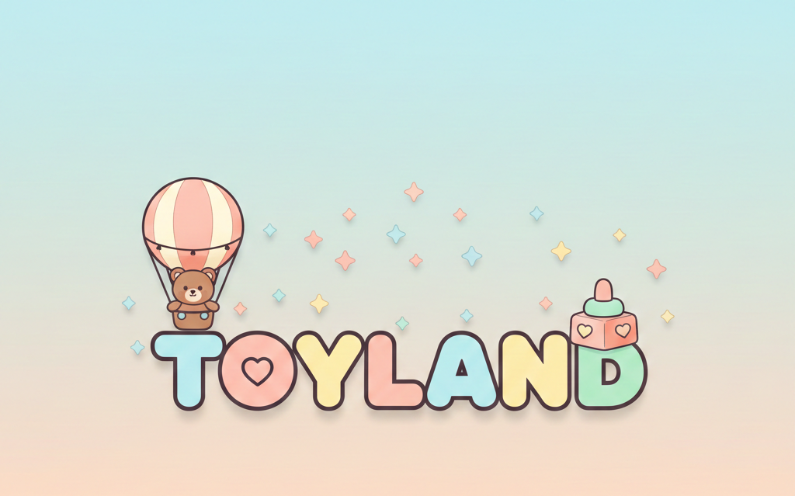

<!DOCTYPE html>
<html lang="ru">
<head>
    <meta charset="UTF-8">
    <meta name="viewport" content="width=device-width, initial-scale=1.0">
    <title>ToyLand - Детский магазин игрушек, одежды и обуви</title>
    <link rel="stylesheet" href="https://cdnjs.cloudflare.com/ajax/libs/font-awesome/6.4.0/css/all.min.css">
    <link href="https://fonts.googleapis.com/css2?family=Poppins:wght@300;400;500;600;700&family=Comic+Neue:wght@400;700&display=swap" rel="stylesheet">
  <link rel="stylesheet" href="styles.css">
</head>
<body>
    <!-- Header & Navigation -->
    <header id="main-header">
        

            <a href="#home" class="logo" data-page="home">
                <i class="fas fa-cube logo-icon"></i>
                <h1>ToyLand</h1>
            </a>
            <button class="mobile-menu-btn" id="mobile-menu-btn">
                <i class="fas fa-bars"></i>
            </button>
   <nav id="main-nav">
                <ul>
                    <li><a href="#home" class="nav-link active" data-page="home">Главная</a></li>
                    <li><a href="#catalog" class="nav-link" data-page="catalog">Каталог</a></li>
                    <li><a href="#sales" class="nav-link" data-page="sales">Акции</a></li>
                    <li><a href="#reviews" class="nav-link" data-page="reviews">Отзывы</a></li>
                    <li><a href="#contacts" class="nav-link" data-page="contacts">Контакты</a></li>
                </ul>
            </nav>     
            

                

                    <i class="fas fa-shopping-cart"></i>
                    0
                

            

        

    </header>   
    <!-- Cart Modal -->
    

        

            <h3>Ваша корзина</h3>
            <button class="close-cart" id="close-cart">
                <i class="fas fa-times"></i>
            </button>
        

        

            <!-- Cart items will be dynamically inserted here -->
            

                
Ваша корзина пуста

            

        

        

            

                Итого:
                0 сом
            

            

                <button class="btn btn-secondary" id="clear-cart">Очистить корзину</button>
                <button class="btn" id="checkout-btn">Оформить заказ</button>
            

        

    

    

    <!-- Home Page -->
    <section class="page active" id="home-page">
        

            

                

                    

                        <h2>Добро пожаловать в ToyLand - где мечты детей сбываются!</h2>
                        
Откройте для себя лучший выбор игрушек, одежды и обуви для ваших малышей. Качественные товары с веселым дизайном, которые обожают дети и которым доверяют родители.

                        <a href="#catalog" class="btn" data-page="catalog">Купить сейчас</a>
                    

                    

                        
                    

                

            

        

        

            <!-- Categories -->
            <section class="categories">
                

                    <h2>Категории товаров</h2>
                
 
                

                    

                        

                            <i class="fas fa-gamepad"></i>
                        

                        <h3>Игрушки</h3>
                        
Развивающие, творческие и веселые игрушки для всех возрастов

                        <a href="#catalog" class="btn btn-small" data-page="catalog" data-filter="toys">Смотреть игрушки</a>
                    

                    

                        

                            <i class="fas fa-tshirt"></i>
                        

                        <h3>Одежда</h3>
                        
Удобная и стильная одежда для детей

                        <a href="#catalog" class="btn btn-small" data-page="catalog" data-filter="clothing">Смотреть одежду</a>
                    

                    

                        

                            <i class="fas fa-shoe-prints"></i>
                        

                        <h3>Обувь</h3>
                        
Прочная и удобная обувь для активных детей

                        <a href="#catalog" class="btn btn-small" data-page="catalog" data-filter="shoes">Смотреть обувь</a>
                    

                

            </section>      
            <!-- Featured Products -->
            <section class="featured-products">
                

                    <h2>Хиты продаж</h2>
                
 
                

                    <!-- Featured products will be dynamically inserted here -->
                

            </section>
        

    </section> 
    <!-- Catalog Page -->
    <section class="page" id="catalog-page">
        

            

                <h2>Каталог товаров</h2>
            
 
            

                <button class="filter-btn active" data-filter="all">Все товары</button>
                <button class="filter-btn" data-filter="toys">Игрушки</button>
                <button class="filter-btn" data-filter="clothing">Одежда</button>
                <button class="filter-btn" data-filter="shoes">Обувь</button>
            
   
            

                <!-- Catalog products will be dynamically inserted here -->
            

        

    </section>
    <!-- Product Detail Page -->
    <section class="page" id="product-page">
        

            

                <!-- Product detail will be dynamically inserted here -->
            

        

    </section>
    <!-- Sales Page -->
    <section class="page" id="sales-page">
        

            

                <h2>Летняя распродажа!</h2>
                
Скидки до 50% на выбранные товары. Предложение ограничено по времени. Не упустите эти удивительные предложения для ваших детей!

                

                    

                        00
                        Дней
                    

                    

                        00
                        Часов
                    

                    

                        00
                        Минут
                    

                    

                        00
                        Секунд
                    

                

            
  
            

                <h2>Товары со скидкой</h2>
            

            

                <!-- Sales products will be dynamically inserted here -->
            

        

    </section>
    <!-- Reviews Page -->
    <section class="page" id="reviews-page">
        

            

                <h2>Отзывы покупателей</h2>
            

            

                

                    

                        

                            

                                <i class="fas fa-user"></i>
                            

                            

                                <h4>Анна Петрова</h4>
                                

                                    <i class="fas fa-star"></i>
                                    <i class="fas fa-star"></i>
                                    <i class="fas fa-star"></i>
                                    <i class="fas fa-star"></i>
                                    <i class="fas fa-star"></i>
                                

                            

                        

                        
15 июня 2023

                    

                    

                        
Моя дочь обожает плюшевую игрушку-единорога, которую мы купили здесь! Качество отличное, и она такая мягкая. Обязательно буду покупать здесь снова!

                    

                

                

                    

                        

                            

                                <i class="fas fa-user"></i>
                            

                            

                                <h4>Дмитрий Иванов</h4>
                                

                                    <i class="fas fa-star"></i>
                                    <i class="fas fa-star"></i>
                                    <i class="fas fa-star"></i>
                                    <i class="fas fa-star"></i>
                                    <i class="fas fa-star-half-alt"></i>
                                

                            

                        

                        
28 мая 2023

                    

                    

                        
Отличная обувь для моего активного 5-летнего ребенка. Прослужила несколько месяцев бега и прыжков. Размер оказался идеальным!

                    

                

                

                    

                        

                            

                                <i class="fas fa-user"></i>
                            

                            

                                <h4>Ольга Смирнова</h4>
                                

                                    <i class="fas fa-star"></i>
                                    <i class="fas fa-star"></i>
                                    <i class="fas fa-star"></i>
                                    <i class="fas fa-star"></i>
                                    <i class="fas fa-star"></i>
                                

                            

                        

                        
10 июля 2023

                    

                    

                        
Покупали детский зимний комбинезон. Качество на высоте, ребенок не мерзнет даже в сильные морозы. Доставка была быстрой, все пришло в целости.

                    

                

                

                    <h3>Добавить отзыв</h3>
                    <form id="review-form">
                        

                            <label for="reviewer-name">Ваше имя</label>
                            <input type="text" id="reviewer-name" required>
                        

                                              

                            <label>Рейтинг</label>
                            

                                <i class="fas fa-star" data-rating="1"></i>
                                <i class="fas fa-star" data-rating="2"></i>
                                <i class="fas fa-star" data-rating="3"></i>
                                <i class="fas fa-star" data-rating="4"></i>
                                <i class="fas fa-star" data-rating="5"></i>
                            

                            <input type="hidden" id="rating-value" value="5">
                        

                        

                            <label for="review-text">Ваш отзыв</label>
                            <textarea id="review-text" required></textarea>
                        
    
                        <button type="submit" class="btn">Отправить отзыв</button>
                    </form>
                

            

        

    </section>
    <!-- Checkout Page -->
    <section class="page" id="checkout-page">
        

            

                <h2>Оформление заказа</h2>
            

            

                

                    <h3>Информация о покупателе</h3>
                    <form id="checkout-form">
                        

                            <label for="full-name">ФИО *</label>
                            <input type="text" id="full-name" required>
                        
  
                        

                            <label for="email">Email адрес *</label>
                            <input type="email" id="email" required>
                        
 
                        

                            <label for="phone">Номер телефона *</label>
                            <input type="tel" id="phone" required>
                        

                        

                            <label for="address">Адрес доставки *</label>
                            <textarea id="address" required></textarea>
                        
 
                        <h3>Способ оплаты</h3>
                        

                            

                                <i class="fas fa-credit-card"></i>
                                
Банковская карта

                            

                            

                                <i class="fas fa-money-bill-wave"></i>
                                
Наличными при получении

                            

                        

                        <input type="hidden" id="payment-method" value="card">     
                        <!-- Card details (shown when card is selected) -->
                        

                            

                                <label for="card-number">Номер карты</label>
                                <input type="text" id="card-number" placeholder="1234 5678 9012 3456">
                            

                            

                                <label for="card-expiry">Срок действия</label>
                                <input type="text" id="card-expiry" placeholder="MM/ГГ">
                            

                            

                                <label for="card-cvc">CVC код</label>
                                <input type="text" id="card-cvc" placeholder="123">
                            

                        
  
                        <button type="submit" class="btn" id="place-order-btn">Оформить заказ</button>
                    </form>
                

                

                    <h3>Сумма заказа</h3>
                    

                        <!-- Order items will be dynamically inserted here -->
                    

                    

                        Итого:
                        0 сом
                    

                

            

        

    </section>
    <!-- Order Success Page -->
    <section class="page" id="order-success-page">
        

            

                <i class="fas fa-check-circle"></i>
                <h2>Спасибо за ваш заказ!</h2>
                
Ваш заказ успешно оформлен. Мы отправим вам подтверждение на email с деталями заказа в ближайшее время.

                
Номер заказа: <strong>#TL-12345</strong>

                
Примерная дата доставки: <strong>3-5 рабочих дней</strong>

                

                    <a href="#home" class="btn" data-page="home">Продолжить покупки</a>
                

            

        

    </section>
    <!-- Contacts Page -->
    <section class="page" id="contacts-page">
        

            

                <h2>Контакты</h2>
            

            

                

                    <h3>Свяжитесь с нами</h3>
                    

                        

                            <i class="fas fa-map-marker-alt"></i>
                        

                        

                            <h4>Наш магазин</h4>
                            
ул. Той 123, Бишкек, Кыргызстан

                        

                    

                    

                        

                            <i class="fas fa-phone"></i>
                        

                        

                            <h4>Номер телефона</h4>
                            
+996 (555) 123-456

                        

                    

                    

                        

                            <i class="fas fa-envelope"></i>
                        

                        

                            <h4>Email адрес</h4>
                            
info@toyland.kg

                        

                    

                    

                        

                            <i class="fas fa-clock"></i>
                        

                        

                            <h4>Часы работы</h4>
                            
Пн - Пт: 9:00 - 20:00

                            
Сб - Вс: 10:00 - 18:00

                        

                    

                

                

                    <h3>Отправить сообщение</h3>
                    <form id="contact-form">
                        

                            <label for="contact-name">Ваше имя</label>
                            <input type="text" id="contact-name" required>
                        
       
                        

                            <label for="contact-email">Ваш Email</label>
                            <input type="email" id="contact-email" required>
                        

                        

                            <label for="contact-message">Ваше сообщение</label>
                            <textarea id="contact-message" required></textarea>
                        
    
                        <button type="submit" class="btn">Отправить сообщение</button>
                    </form>
                    

                        

                            <i class="fas fa-map-marked-alt"></i>
                            
Карта расположения магазина

                            
ул. Той 123, Бишкек

                        

                    

                

            

        

    </section>
    <!-- Footer -->
    <footer>
        

            

                

                    <h3>ToyLand</h3>
                    
Лучший интернет-магазин детских игрушек, одежды и обуви. Качественные товары с заботой и любовью для ваших детей.

                

                

                    <h3>Быстрые ссылки</h3>
                    <ul class="footer-links">
                        <li><a href="#home" data-page="home">Главная</a></li>
                        <li><a href="#catalog" data-page="catalog">Каталог</a></li>
                        <li><a href="#sales" data-page="sales">Акции</a></li>
                        <li><a href="#reviews" data-page="reviews">Отзывы</a></li>
                        <li><a href="#contacts" data-page="contacts">Контакты</a></li>
                    </ul>
                

                

                    <h3>Категории</h3>
                    <ul class="footer-links">
                        <li><a href="#catalog" data-page="catalog" data-filter="toys">Игрушки</a></li>
                        <li><a href="#catalog" data-page="catalog" data-filter="clothing">Одежда</a></li>
                        <li><a href="#catalog" data-page="catalog" data-filter="shoes">Обувь</a></li>
                        <li><a href="#catalog" data-page="catalog" data-filter="all">Все товары</a></li>
                    </ul>
                

                

                    <h3>Контактная информация</h3>
                    <ul class="footer-links">
                        <li><i class="fas fa-map-marker-alt"></i> ул. Той 123, Бишкек</li>
                        <li><i class="fas fa-phone"></i> +996 (555) 123-456</li>
                        <li><i class="fas fa-envelope"></i> info@toyland.kg</li>
                    </ul>
                

            

            

                
&copy; 2023 ToyLand. Все права защищены. | Сделано с <i class="fas fa-heart" style="color: var(--primary);"></i> для детей

            

        

    </footer>
    
</body>
</html>
